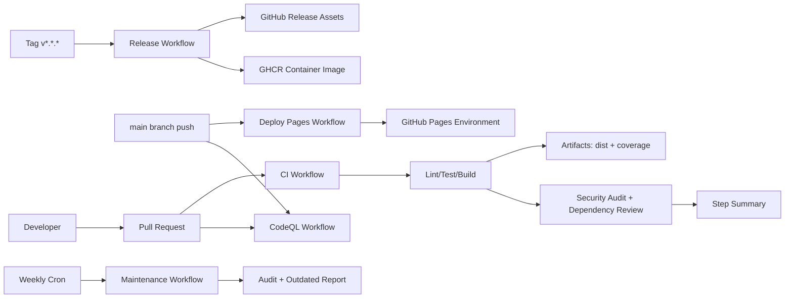
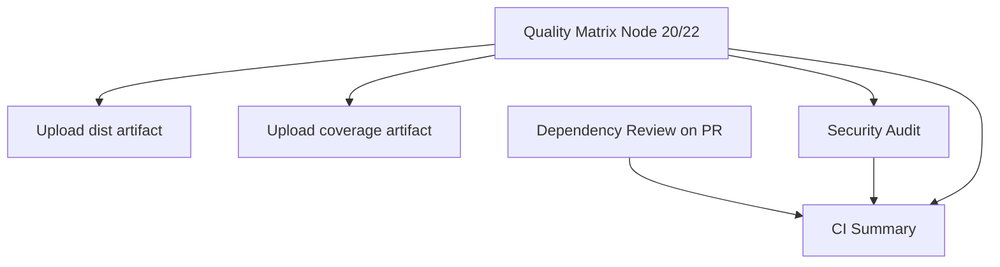
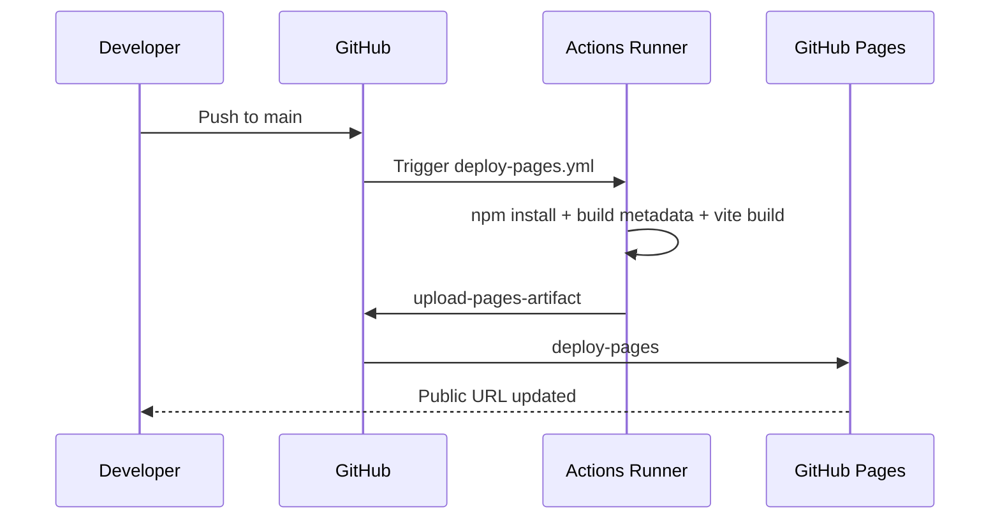

# Diagrams

## Repository Architecture

```mermaid
flowchart LR
  Dev[Developer] --> PR[Pull Request]
  PR --> CI[CI Workflow]
  CI --> QA[Lint/Test/Build]
  QA --> ART[Artifacts: dist + coverage]
  QA --> SEC[Security Audit + Dependency Review]
  SEC --> SUM[Step Summary]

  MAIN[main branch push] --> DEPLOY[Deploy Pages Workflow]
  DEPLOY --> GP[GitHub Pages Environment]

  TAG[Tag v*.*.*] --> REL[Release Workflow]
  REL --> GHREL[GitHub Release Assets]
  REL --> GHCR[GHCR Container Image]

  SCHED[Weekly Cron] --> MAINT[Maintenance Workflow]
  MAINT --> AUDIT[Audit + Outdated Report]

  MAIN --> CODEQL[CodeQL Workflow]
  PR --> CODEQL
```

## CI Workflow Job Graph

```mermaid
flowchart TD
  Q[Quality Matrix Node 20/22] --> A1[Upload dist artifact]
  Q --> A2[Upload coverage artifact]
  Q --> S[Security Audit]
  D[Dependency Review on PR] --> Z[CI Summary]
  S --> Z
  Q --> Z
```

## Deployment Sequence

```mermaid
sequenceDiagram
  participant Dev as Developer
  participant GH as GitHub
  participant Act as Actions Runner
  participant Pages as GitHub Pages

  Dev->>GH: Push to main
  GH->>Act: Trigger deploy-pages.yml
  Act->>Act: npm install + build metadata + vite build
  Act->>GH: upload-pages-artifact
  GH->>Pages: deploy-pages
  Pages-->>Dev: Public URL updated
```
